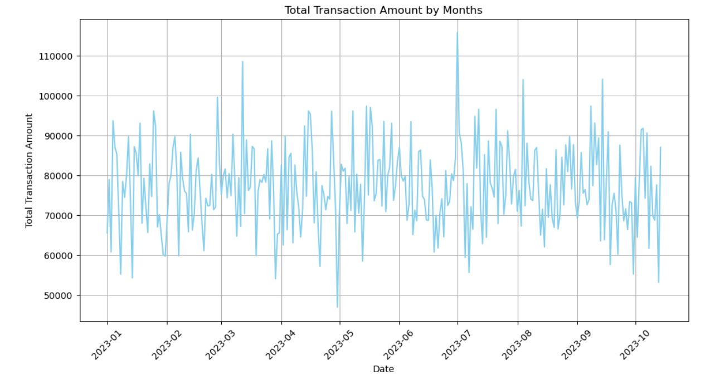

# customer_transactions

# Introduction

## Project: Understanding and Optimizing Customer Card Transaction Insights

## Contents

- Project Overview

- Data Wrangling

- Exploratory Data Analysis

- Conclusion

  ## Project Overview:
  
This project aims to comprehensively understand and optimize customer card transaction insightsBy delving into gender-based spending patterns, identifying peak transaction periods, analyzing time-based trends, evaluating merchant performance, and summarizing category-wise transaction insights, the project seeks to provide actionable recommendations for improving financial strategies, customer experiences, and overall business outcomes.

Original data can be access using this link:/kaggle/input/comprehensive-credit-card-transactions-dataset/credit_card_transaction_flow.csv'

## Data Dictionary 

01 - Customer: Identification of a customer

02 - Name: The first name of each customer

03 - Surname: The last name of each customer

04 - Gender: Male or Female

05 - Birthdate: The date of birth of each customer

06 - Transaction Amount: The amount .each customers used for purchased

07 - Date: The date when the transaction was made for purchase.

08 - Merchant Name:The name of the company or person who sell the goods and services

09 - Category: The type of goods that was purchased.

  ## Problem statement
  
  Analyzing this dataset aim to answer the following:
  
1.Is their a pattern in spending behaviour based on gender.

2.Are their a specific days or months with higher volumes.

3.What is the trends in transaction amount over time.

4.sum of transaction amount for each category.

## Data Transformation

### Data Wrangling

- Checking the general info about the data
 
- Checking for null values

- Checking for unique count in each column

  ### Data Cleaning
  
 - Dropping of Customer ID

 - Filling of null values

- Changing the Date and Birthdate to datetime types

-  Converting Birthdate to Age

-  Removing of duplicate values

## Analysis And Visualization

### Understanding Spending Patterns by Gender

The spending behavior analysis by gender reveals a balanced distribution, with males contributing 33.7%, females 33.4%, and "Not Specified" at 32.9%. The equal proportions between males and females suggest gender-neutral spending patterns, emphasizing the significance of the "Not Specified" category and the need for details  analysis.

### Identifying High-Volume Days or Months

July emerges as the peak month for transactions, recording a substantial total exceeding $110,000 in received amounts. In contrast, February stands out with the lowest transaction figures, dipping below $5,000. This data reveals pronounced monthly variations, indicating potential seasonal or contextual factors influencing transaction volumes throughout the year.

### Sum of transaction amount across categories

The data analysis shows distinct spending patterns, revealing that "Travel" commands the highest transaction amounts, closely followed by "Electronics." In contrast, "Restaurant" transactions exhibit the lowest amounts. This insight highlights consumer priorities, with considerable expenditures in travel and electronics, potentially indicating lifestyle preferences and economic priorities.

## Conclusion And Recommendation

### Conclusion
The transaction analysis reveals diverse spending patterns across genders, categories, and months. While gender-based spending is balanced, "Travel" and "Electronics" lead in categories. July marks peak transactions, and attention to the "Not Specified" gender category is crucial. Strategic marketing adjustments can capitalize on insights, fostering business growth.

### Recommendation

Improve gender data collection methods to enhance accuracy and completeness.
Tailor marketing strategies for high-performing categories like "Travel" and "Electronics.
Leverage insights from peak months for strategic planning and promotional activities.
Explore initiatives to stimulate transactions in lower-performing categories, such as "Restaurant.

 

